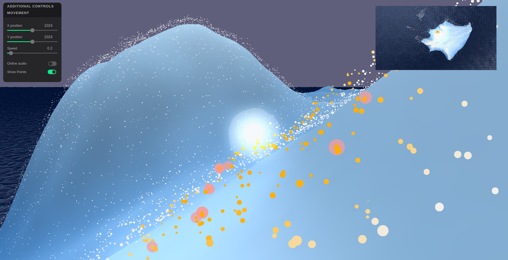

# re:Discover

This project is part of The Wandering Mind project. Re:Discover is an auditory experience where you can navigate in a virtual world to generate a soundscape. There is a local coherence between the sounds, creating thematic zones recognizable by the human being.

You can use the online version available [here](https://cables.gl/p/MrllSN) or use this repository to connect an AI as a controller or have sound spatialization.

## Installation

Use `pip3 install -r requirements.txt` to install the required packages.

Download fmodapi from [drive](https://drive.google.com/file/d/1x6vUOR-Wd_HBsjHQo_IHatQkx6xeQoOR/view?usp=sharing) or from fmod [site](://fmod.com/download)
and unzip in `audio/vendors/fmod`.

Have a csv file of audio chunks info with their file path, chunk id, and spatial coordinates (or embeddings) and put it in `audio/`.

Create a symlink to `audio/mp3` containning trimmed audio files for the aporee dataset.

Build with `cd audio && make build`

## Usage

To launch the core of the program, use `make core`

To launch the GUI, use `make gui`

To launch the audio software, use `maek audio`
